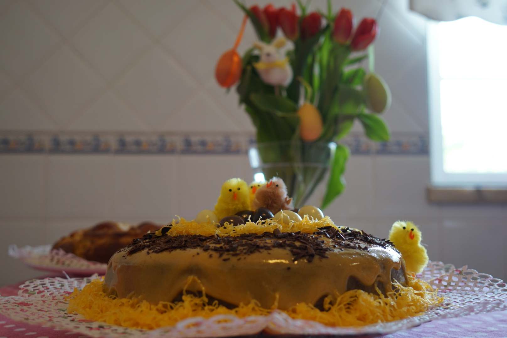

Páscoa é sinónimo de doces! Mas isso não quer dizer que os doces à nossa mesa tenham de ser pouco saudáveis. Este ano, fiz um ninho de Páscoa cuja base é um bolo de cacau maravilhoso (inspirado numa [receita](https://glutenfree.pt/bolo-de-cacau/) do blog GlutenFree da Sofia Paixão) com cobertura de doce de ovos caseiro. 

_Dose_: 8 a 12 pessoas

_Tempo_: 60 minutos 

_Ingredientes para o bolo_:

* 6 ovos M
* 200 g de açúcar mascavado
* 90 g de azeite
* 90 g de manteiga derretida
* 150 ml de bebida de aveia
* 60 g de farinha de arroz
* 60 g de farinha de aveia
* 60 g de fécula de batata
* 45 g de farinha de amêndoa
* pitada de sal marinho (intensifica o sabor do cacau)
* 50 g de cacau puro em pó
* 2 c. de chá de fermento para bolos
* 1 c. de chá de bicabornato

_Método_:

Numa taça, bater os ovos com o açúcar até duplicarem de volume. Juntar o azeite, a manteiga e a bebida de aveia, batendo entre cada adição. Noutra taça, juntar todos os ingredientes secos e misturar. Adicionar colheradas destes ingredientes à primeira massa, enquanto bate, até obter uma mistura lisa. Deitar numa forma untada com manteiga e farinha de arroz e levar a forno pré-aquecido a 180º C durante 35-45 minutos. Se não for rechear e gostar de bolos mal-cozidos (tipo mousse no meio) recomendo deixar apenas 35 minutos. Deixar arrefecer e desenformar com cuidado. 

_Ingredientes para o doce de ovos_:

* 6 gemas
* 6 c. de sopa de açúcar mascavado
* 6 c. de sopa de água

_Método_:

Levar o açúcar e a água ao lume, num tachinho, até o açúcar se dissolver e começar a ferver. Deixar ferver 2 minutos e retirar do lume, deixando arrefecer um pouco. Entretanto, passar as gemas furadas por um passador de rede e depois adicionar à mistura do açúcar, mexendo sempre (com uma vara de arames). Levar novamente ao lume para engrossar até ficar um creme. Se não for utilizar de seguida, cobrir com película aderente (em contacto com o topo do creme) e levar ao figorífico. Cobrir o bolo com o doce de ovos. 

Pode enfeitar com fios de ovos, amêndoas e uns pintainhos bem fofinhos! 

